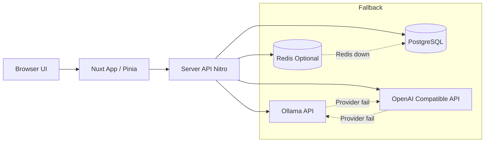

# Arsitektur Sistem

## Ringkasan

Aplikasi ini adalah chatbot full-stack berbasis Nuxt 4 dengan komponen utama:

- Frontend Nuxt + Pinia untuk state auth/chat.
- API server (Nitro/H3) di folder server/api.
- Database PostgreSQL via Prisma.
- Redis sebagai akselerator cache/queue (opsional).
- Fallback queue berbasis tabel database saat Redis bermasalah.
- AI provider dengan strategi fallback:
  - Authenticated/admin: ollama-first, openai fallback.
  - Public/guest: openai-first, ollama fallback.

## Komponen Utama

### Frontend Layer

- Halaman utama chat authenticated: app/pages/chat.vue
- Halaman public demo: app/pages/try.vue
- State auth: app/stores/auth.ts
- State chat: app/stores/chat.ts
- API wrapper dengan bearer token: app/composables/useApi.ts
- Chat streaming client (EventSource): app/composables/useChat.ts

### API Layer

- Auth + profile + passkey: server/api/auth/*
- Neon auth bridge + oauth helpers: server/api/auth/neon/*
- Chat authenticated: server/api/chat/*
- Chat public guest: server/api/guest/*
- Admin tools: server/api/admin/*
- Models list: server/api/models/index.get.ts

### Business Utilities

- Middleware auth API: server/middleware/auth.ts
- Guard admin role: server/utils/adminGuard.ts
- JWT sign/verify: server/utils/jwt.ts
- Neon auth client: server/utils/neonAuth.ts
- Identity-to-local-user mapper: server/utils/authUser.ts
- Provider router/fallback LLM: server/utils/llm.ts
- Ollama client: server/utils/ollama.ts
- Queue abstraction Redis -> DB: server/utils/chatQueue.ts
- Guest session controls: server/utils/guestSession.ts
- Token-based access control: server/utils/tokenAccess.ts

### Data Layer

- Prisma client: server/utils/prisma.ts
- Schema: prisma/schema.prisma
- Migration files: prisma/migrations/*

## Diagram Arsitektur Tingkat Tinggi

## Boundary Security

- Semua route API non-public dicek oleh middleware server/middleware/auth.ts.
- Middleware menerima local JWT dan Neon JWT, lalu memetakan identity ke user lokal untuk role/otorisasi aplikasi.
- Endpoint SSE chat menggunakan query token karena EventSource tidak bisa custom header.
- Endpoint admin memakai requireAdmin untuk role check tambahan.
- Token guest khusus memakai header x-access-token.

## Admin App Health

- Endpoint internal health DB: GET /api/internal/db-connection (admin-only).
- Dashboard sidebar menampilkan status source database (primary/fallback), ping, dan latency dengan polling periodik.

## Alur Utama

### 1) Authenticated Chat

1. Frontend kirim POST ke /api/chat/send.
2. Message user disimpan di tabel messages.
3. Job queue disimpan ke chat_queue_jobs (source of truth).
4. Jika Redis tersedia, payload juga didorong ke Redis list.
5. Frontend buka SSE ke /api/chat/stream/:sessionId?token=...
6. Server dequeue job (prioritas Redis, fallback DB), stream chunk, simpan reply assistant.

### 2) Public Guest Chat

1. Frontend hit POST /api/guest/chat.
2. Server cek status guest + limit.
3. Server generate reply via openai-first fallback.
4. Counter guest/token increment, rollback bila provider error.

### 3) Model Discovery

1. Frontend call GET /api/models.
2. Server coba fetch Ollama tags.
3. Jika gagal dan OpenAI configured, return model fallback synthetic.

## Prinsip Desain yang Dipakai

- Graceful degradation: layanan tetap jalan walau Redis/Ollama tidak tersedia.
- Durability: queue item persist ke DB sebelum diproses.
- Separation of concerns: util terpisah per domain (auth, queue, llm, guest).
- Observable failure: error dilempar jelas ke client, status queue ditandai FAILED.
