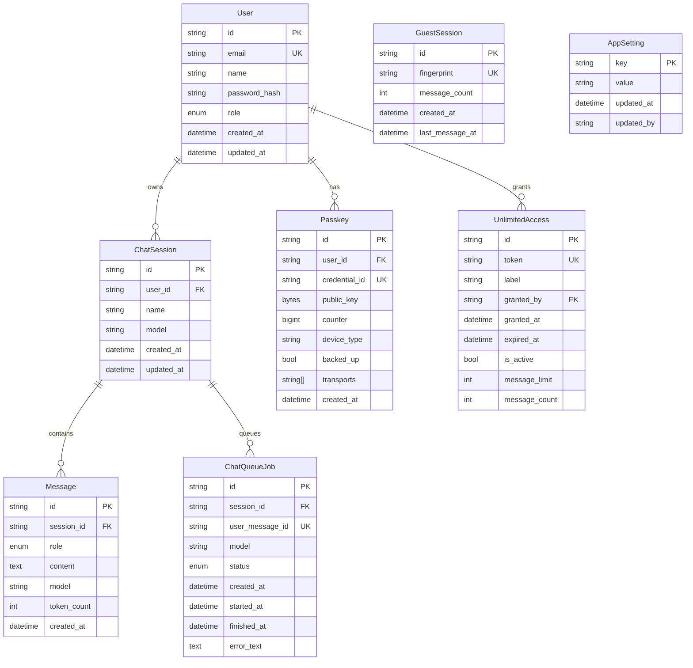

# ERD

## Diagram ERD

## Catatan Relasi

- User -> ChatSession: 1 ke banyak.
- ChatSession -> Message: 1 ke banyak (cascade delete).
- ChatSession -> ChatQueueJob: 1 ke banyak (cascade delete).
- User -> Passkey: 1 ke banyak (cascade delete).
- User -> UnlimitedAccess: 1 ke banyak sebagai admin pemberi token.
- GuestSession berdiri sendiri (berbasis fingerprint cookie).
- AppSetting berdiri sendiri sebagai key-value config global.

## Catatan Domain

- Message.role memakai enum user/assistant/system.
- ChatQueueJob.status memakai enum PENDING/PROCESSING/DONE/FAILED.
- UnlimitedAccess dipakai untuk mode guest bertoken via header x-access-token.
